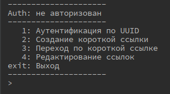

# "**Итоговый проект «Сервис коротких ссылок»**"

При запуске выводится меню:

В заголовке отображается аутентифицированный пользователь, а меню
состоит из следующих элементов:

1.  Аутентификация по UUID -- если пользователь знает свой UUID, то
    выбрав данный пункт он сможет его ввести и, в случае удачи, будет
    аутентифицирован. Также его UUID будет отображаться в заголовке
    меню:

В случае неудачи будет выведена ошибка:

2.  Создание короткой ссылки -- при выборе будет предложено ввести адрес
    ссылки, максимальное количество переходов и время жизни. Некоторые
    параметры имеют значение по-умолчанию, в этом случае можно просто
    нажать Enter. Если ссылка не начинается с http или https, то она
    автоматически дополнится префиксом https. При этом, если
    пользователь не был аутентифицирован, автоматически произойдёт
    создание и аутентификация нового пользователя, а также будет
    выведено сообщение об этом. Также будет выведена информация о
    созданной короткой ссылке:

Если пользователь уже был аутентифицирован, то будет выведена только
информация о короткой ссылке:

Если пользователь ранее уже сохранял эту ссылку об этом будет выведено
сообщение (при этом учитываются ссылки только конкретного пользователя):

3.  Переход по короткой ссылке -- тут можно ввести короткую ссылку,
    произойдёт переход по сохранённому адресу. При этом будет уменьшено
    количество переходов и учтено время жизни ссылки. Как только будет
    достигнуто какое-либо ограничение, об этом будет выведено сообщение:

Также можно указать одну или несколько ссылок в качестве аргументов при
запуске программы. В этом случае программа запустит те ссылки, которые
возможно запустить, выведет информацию о тех ссылках, которые запустить
невозможно и выйдет, не выводя меню.

4.  Редактирование ссылки -- пункт доступен только, если пользователь
    аутентифицирован:

В случае, если аутентификация пройдена, будет выведен список адресов и
предложено ввести порядковый номер ссылки, которую нужно будет
отредактировать:

При выборе ссылке будет предложено изменить все пункты, при этом текущие
значения будут доступны как значения по-умолчанию:

Как видим, значение ссылки изменилось:

Через некоторое время после окончания времени действия, ссылка
автоматически удалится (5 минут):

5.  Все настройки указаны в константах (service.Config). Константа
    DELETE_EXPIRED_AFTER_MINUTES = 0 означает, что удаления ссылок не
    будет происходить.
